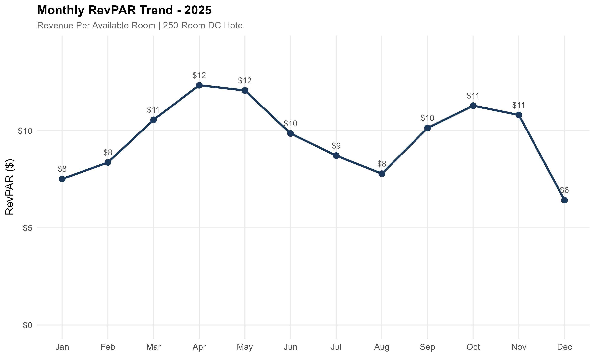
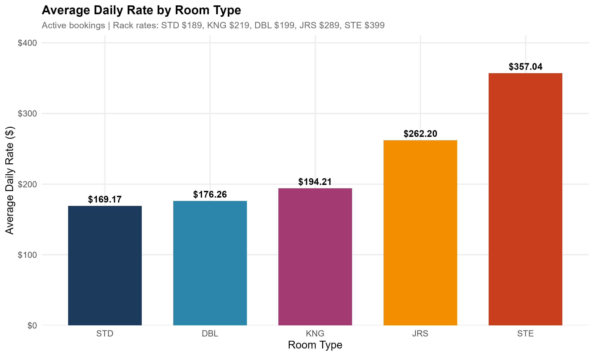
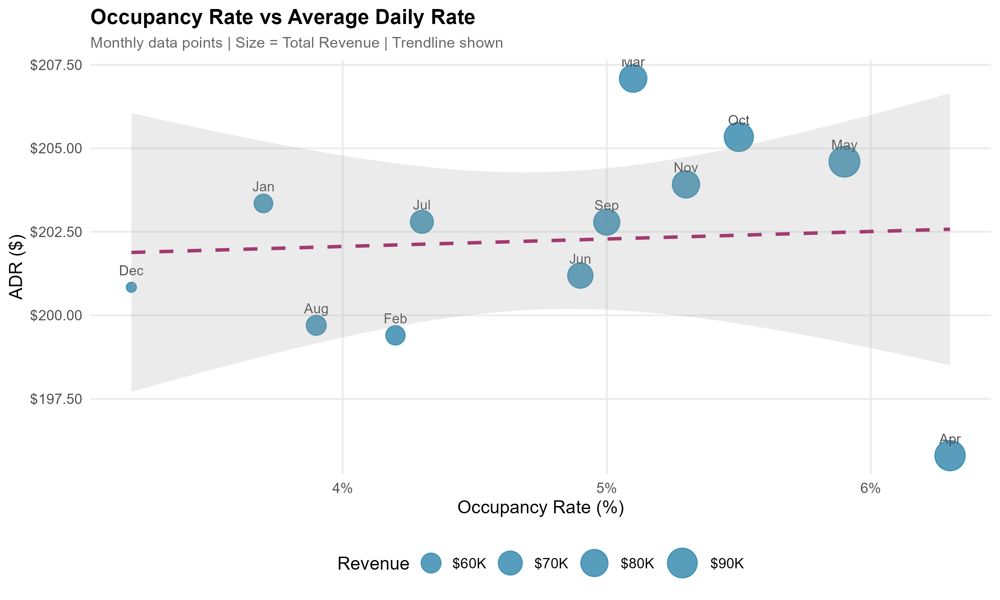
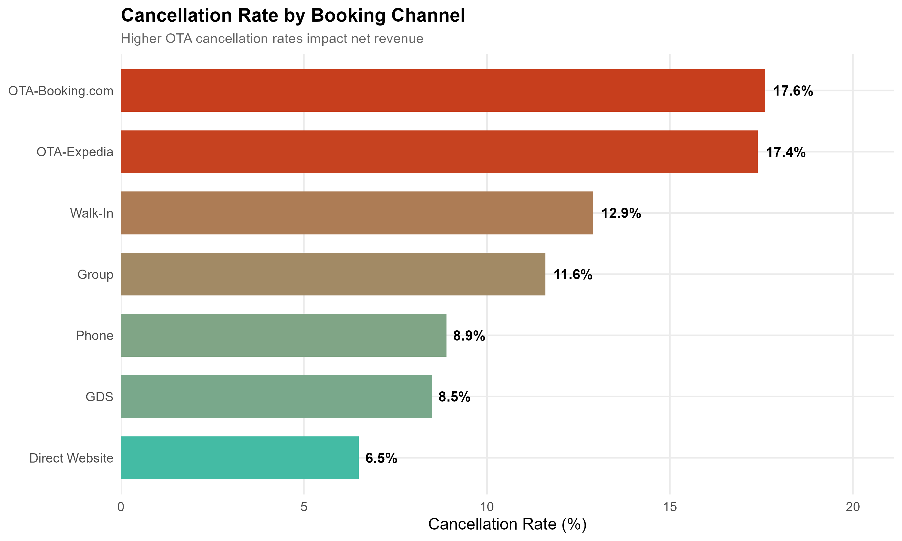
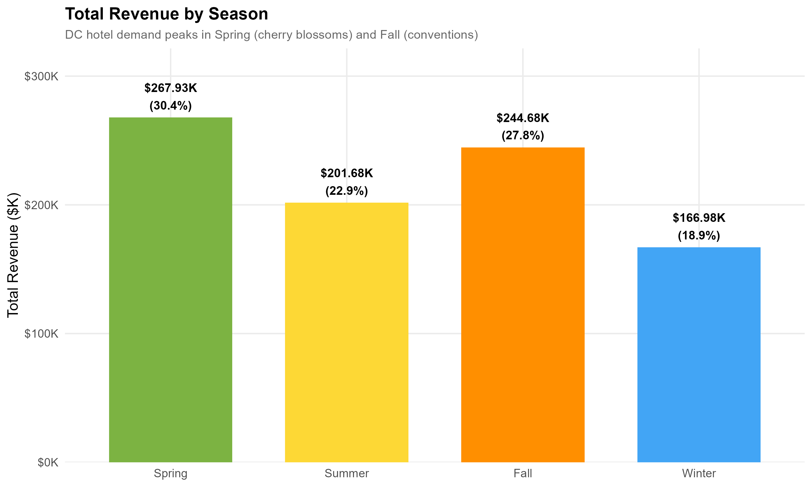
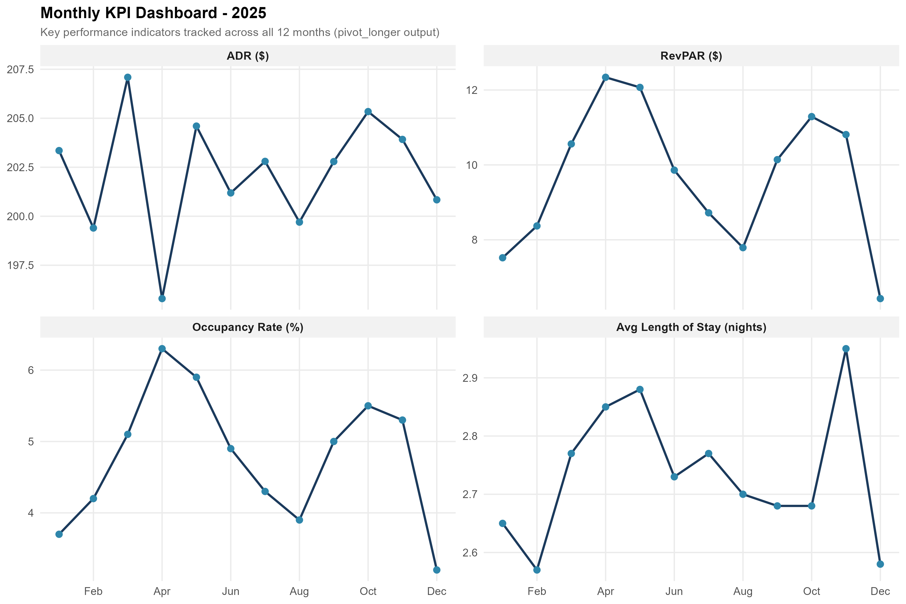
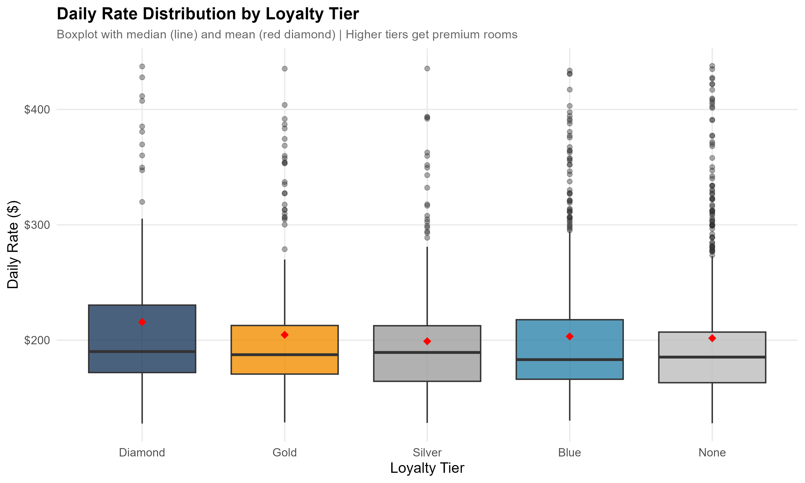

# Hotel Revenue Analytics Pipeline

> Complete ETL pipeline processing a 1,800-row PMS export for a 250-room hotel — star schema design, hospitality KPI calculations (ADR, RevPAR, occupancy), and 8 publication-ready visualizations.


## Business Context

Hotel revenue managers rely on Property Management Systems (OnQ, OPERA) to track daily performance. Raw PMS exports are messy — mixed date formats, duplicates, inconsistent casing. This project demonstrates the full pipeline from messy data to actionable revenue insights, computing the exact KPIs that drive pricing and inventory decisions at hotels like Hilton, Marriott, and IHG.

## Dashboards

| | |
|:---:|:---:|
|  |  |
| **RevPAR Trend Analysis** | **ADR by Room Type** |
|  |  |
| **Revenue by Booking Channel** | **Occupancy vs ADR Scatter** |
|  |  |
| **Cancellation Rate by Channel** | **Revenue by Season** |
|  |  |
| **KPI Dashboard** | **Rate by Loyalty Tier** |

## Key Hospitality KPIs

| KPI | Description |
|-----|-------------|
| **ADR** (Average Daily Rate) | Total room revenue / rooms sold |
| **RevPAR** (Revenue Per Available Room) | Total room revenue / total available rooms |
| **Occupancy Rate** | Rooms sold / rooms available |
| **ALOS** (Average Length of Stay) | Total guest nights / total bookings |

## Technical Architecture

```
Raw PMS CSV → ETL (cleaning, dedup, standardization)
            → Star Schema (5 dimension + 1 fact table)
            → KPI Calculations (ADR, RevPAR, Occupancy, ALOS)
            → 8 ggplot2 Visualizations
```

## Project Structure

```
hotel-revenue-analytics/
├── scripts/
│   └── hotel_revenue_pipeline.R          # Complete ETL + analysis pipeline
├── output/
│   └── plots/                            # 8 publication-ready visualizations
├── .gitignore
└── README.md
```

## How to Run

```r
# Requires R >= 4.0 with: tidyverse, lubridate, scales
# Run the full pipeline:
source("scripts/hotel_revenue_pipeline.R")
```

## Tools Used

- **R** (tidyverse): dplyr, tidyr, ggplot2, readr, stringr
- **lubridate**: Date parsing and manipulation
- **scales**: Formatted axis labels
- **Star Schema**: Normalized data warehouse design

## Author

**Deepanshi Behal** | [LinkedIn](https://linkedin.com/in/bdeepanshi) | [GitHub](https://github.com/behaldeepanshi01-gif)
