# Hotel Revenue Analytics Pipeline

A complete data analytics pipeline simulating a Property Management System (PMS) export for a 250-room hotel in Washington D.C., built with R and the tidyverse. Demonstrates ETL processing, star schema design, hospitality KPI calculations, and data visualization.

## Project Overview

This project processes a messy 1,800-row dataset (simulating a PMS export like OnQ or OPERA) through a full ETL pipeline, builds a star schema data warehouse, calculates industry-standard hotel KPIs, and produces 8 publication-ready visualizations.

### Skills Demonstrated
- **ETL Pipeline**: Extract, transform, and load with data quality handling
- **Star Schema Design**: 5 dimension tables + 1 fact table
- **Data Wrangling**: tidyverse (dplyr, tidyr, stringr, lubridate)
- **Pivoting**: `pivot_wider` and `pivot_longer` for reshaping data
- **Data Visualization**: 8 ggplot2 charts with custom theming
- **Domain Knowledge**: Hospitality industry terminology and KPIs

## Star Schema Design

```mermaid
erDiagram
    fact_bookings ||--o{ dim_guest : guest_key
    fact_bookings ||--o{ dim_room : room_key
    fact_bookings ||--o{ dim_date : date_key
    fact_bookings ||--o{ dim_channel : channel_key
    fact_bookings ||--o{ dim_rate_code : rate_key

    fact_bookings {
        int fact_id PK
        string booking_id
        int guest_key FK
        int room_key FK
        int date_key FK
        int channel_key FK
        int rate_key FK
        date check_in_date
        date check_out_date
        int nights
        float daily_rate
        float total_revenue
        int booking_lead_days
        int num_guests
        boolean is_cancelled
    }

    dim_guest {
        int guest_key PK
        string guest_name
        string loyalty_tier
        string guest_type
    }

    dim_room {
        int room_key PK
        string room_type_code
        string room_type_name
        float rack_rate
        string floor_category
        int max_occupancy
    }

    dim_date {
        int date_key PK
        date full_date
        int year
        int quarter
        string month_name
        string day_of_week
        boolean is_weekend
        string season
    }

    dim_channel {
        int channel_key PK
        string channel_name
        string channel_category
        float commission_pct
    }

    dim_rate_code {
        int rate_key PK
        string rate_code
        string rate_description
        float discount_pct
    }
```



## ETL Pipeline Flow


## Analytics & KPI Flow


## Key Hospitality Metrics

| Metric | Definition |
|--------|-----------|
| **ADR** (Average Daily Rate) | Total room revenue / Number of rooms sold |
| **RevPAR** (Revenue Per Available Room) | ADR x Occupancy Rate |
| **Occupancy Rate** | Rooms sold / Rooms available |
| **ALOS** (Average Length of Stay) | Total room nights / Total bookings |

## Dataset Details

The raw dataset simulates a PMS export with deliberate data quality issues:

| Issue | Description |
|-------|-------------|
| Mixed date formats | `YYYY-MM-DD` and `MM/DD/YYYY` mixed in same column |
| Inconsistent casing | Guest names in Title Case, UPPER CASE, and lower case |
| Mixed boolean encoding | Cancellation flag as `Y/N`, `Yes/No`, `yes/no`, `1/0` |
| Missing values | ~3-5% NAs across daily_rate, loyalty_tier, num_guests |
| Whitespace | Leading/trailing spaces in booking channel names |
| Duplicates | 30 exact duplicate rows |

### Room Types (Industry Standard Codes)
| Code | Type | Rack Rate |
|------|------|-----------|
| STD | Standard Queen | $189 |
| KNG | King Room | $219 |
| DBL | Double Queen | $199 |
| JRS | Junior Suite | $289 |
| STE | Executive Suite | $399 |

### Rate Codes
| Code | Description | Discount |
|------|-------------|----------|
| BAR | Best Available Rate | 0% |
| AAA | AAA Member Rate | 15% |
| GOV | Government Rate | 20% |
| CORP | Corporate Negotiated | 18% |
| PKG | Package Rate | 10% |
| DISC | Advance Discount | 25% |

### Booking Channels
- **Direct**: Website, Phone, Walk-In
- **OTA**: Expedia, Booking.com (higher commission, higher cancellation)
- **Indirect**: GDS (Global Distribution System)
- **Group**: Group/block bookings

## ETL Pipeline

The ETL script (`02_etl_pipeline.R`) performs:

1. **Extract**: Read raw CSV with `read_csv()`
2. **Transform**:
   - `distinct()` to remove 30 duplicate rows
   - `str_trim()` to remove whitespace
   - `str_to_title()` / `str_to_upper()` for case standardization
   - `parse_date_time()` with multiple format orders for mixed dates
   - `case_when()` to unify boolean encoding
   - `replace_na()` for missing loyalty tiers and guest counts
   - Impute missing daily rates using rack rate and discount formulas
   - Recalculate missing total revenue from daily rate and nights
3. **Load**: Build 6 star schema tables with surrogate keys and export to CSV

## Visualizations

Eight ggplot2 charts saved to `output/plots/`:

| # | Chart | Description |
|---|-------|-------------|
| 1 | Monthly RevPAR Trend | Line chart tracking revenue per available room |
| 2 | ADR by Room Type | Bar chart comparing average daily rates |
| 3 | Revenue by Channel | Stacked bar showing quarterly channel mix |
| 4 | Occupancy vs ADR | Scatter plot with trend line and revenue sizing |
| 5 | Cancellation Rate by Channel | Horizontal bar chart (OTA vs Direct) |
| 6 | Revenue by Season | Seasonal demand patterns for DC market |
| 7 | KPI Dashboard | Faceted line charts using `pivot_longer` output |
| 8 | Rate by Loyalty Tier | Boxplot showing rate distribution across tiers |

### Sample Outputs

<p align="center">
  
  
</p>
<p align="center">
  
  
</p>

## Project Structure

```
hotel-revenue-analytics/
├── data/
│   ├── raw/hotel_bookings_raw.csv          # 1,800+ rows, messy raw data
│   └── processed/                          # Star schema + analytics CSVs
│       ├── dim_guest.csv
│       ├── dim_room.csv
│       ├── dim_date.csv
│       ├── dim_channel.csv
│       ├── dim_rate_code.csv
│       ├── fact_bookings.csv
│       ├── analytics_monthly_kpis.csv
│       ├── analytics_channel_performance.csv
│       ├── analytics_cancellation.csv
│       ├── analytics_loyalty.csv
│       ├── analytics_room_quarter.csv
│       ├── analytics_kpi_long.csv
│       ├── analytics_seasonal.csv
│       └── bookings_denormalized.csv
├── scripts/
│   ├── 01_generate_dataset.R               # Dataset generation
│   ├── 02_etl_pipeline.R                   # ETL pipeline + star schema
│   ├── 03_revenue_analytics.R              # KPI calculations + pivoting
│   └── 04_visualizations.R                 # 8 ggplot2 visualizations
├── output/plots/                           # Saved PNG charts
└── README.md
```

## How to Run

### Prerequisites
- R (>= 4.0)
- RStudio (recommended)
- Required packages: `tidyverse`, `lubridate`, `scales`

```r
install.packages(c("tidyverse", "lubridate", "scales"))
```

### Execution Order

Open the project in RStudio and set the working directory to the project root, then run scripts in order:

```r
setwd("path/to/hotel-revenue-analytics")

source("scripts/01_generate_dataset.R")    # Generates raw data
source("scripts/02_etl_pipeline.R")        # Cleans data, builds star schema
source("scripts/03_revenue_analytics.R")   # Calculates KPIs, pivots data
source("scripts/04_visualizations.R")      # Creates all 8 charts
```

Each script prints progress and summary statistics to the console.

## Technologies

- **R** with tidyverse (dplyr, tidyr, ggplot2, readr, stringr)
- **lubridate** for date parsing and manipulation
- **scales** for formatted axis labels
- **Star schema** data warehouse design pattern

## Glossary

| Term | Definition |
|------|-----------|
| PMS | Property Management System (e.g., Oracle OPERA, Hilton OnQ) |
| OTA | Online Travel Agency (Expedia, Booking.com) |
| GDS | Global Distribution System (Sabre, Amadeus) |
| BAR | Best Available Rate (standard public rate) |
| Rack Rate | Published maximum rate for a room type |
| Transient | Individual guest (vs. group booking) |
| Lead Time | Days between booking creation and check-in |
| ADR | Average Daily Rate |
| RevPAR | Revenue Per Available Room |
